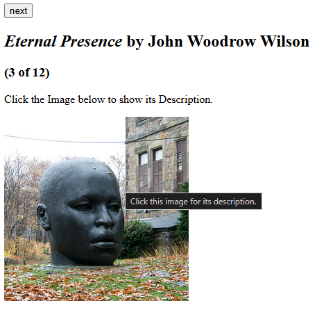
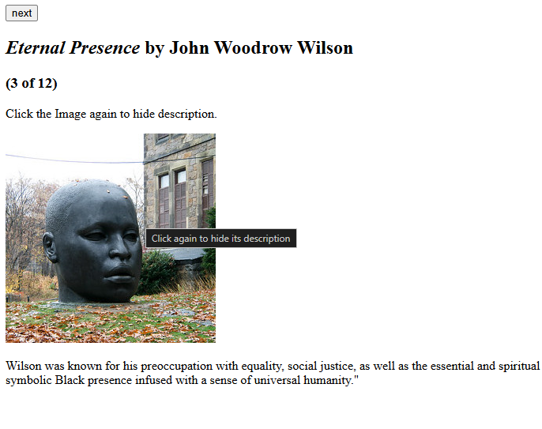

# React Assignment - Clickable Images with Toggleable Description

This project is part of my **full stack internship** at **CepiaLabs** during my **probation period**.  
As part of the daily technical sessions, I was given a **React codebase** and assigned the following task:

👉 **Make the displayed images clickable.**  
👉 **On image click → show the description of the image.**  
👉 **On clicking the image again → hide the description.**

This project demonstrates my understanding of **React state (`useState`)**, **event handling**, and **conditional rendering**.

---

## 🚀 Features Implemented

- **Next Button** → Navigate through the images in the `sculptureList`.
- **Image Click Handling** → Clicking the image toggles its description.
- **Conditional Rendering** → Description is only shown if `showMore === true`.
- **Dynamic Titles/Tooltips** → Image tooltip message changes depending on toggle state.

---

## 📸 Screenshots

### 🔹 Initial View (Before Clicking the Image)

Here, only the image is visible and the user is prompted to click it for description.

---

### 🔹 After Clicking the Image (Description Shown)

Here, the description appears below the image.

---

## 🎥 Demo Video / GIF

A short demo video or GIF showcasing the clickable image toggle functionality will be added here soon for better visualization.

_Example:_  

---

## 🛠️ Source Code (Implemented Solution)

The main change I introduced was making the **image clickable** and using the `showMore` state to **toggle description visibility**:
